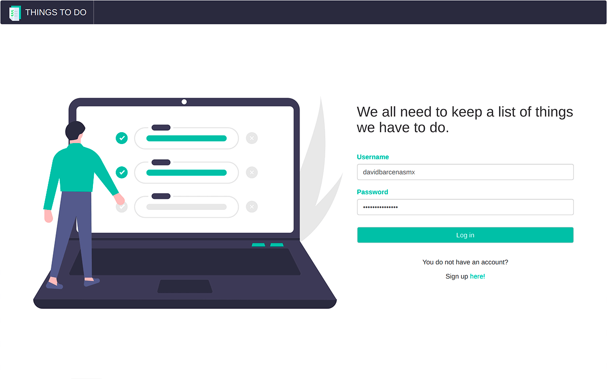

# Flask - Things To Do

Single page application that allows you to create, read, update and delete to-do's.

### Preview  

You can see more screenshots of the application [here](./.readme-static/app-preview.md).

### Technologies

* Flask
* Templates with Jinja2
* Flask bootstrap
* Flask WTF
* Google Cloud
* Firestore

### Running the app

Clone/download the project and run `pip install -r requirements.txt` to build the dependencies the project needs.

#### Development

Run `flask run` for a dev server. Navigate to `http://localhost:5000/`

### License

Released under the [MIT licensed](LICENSE)